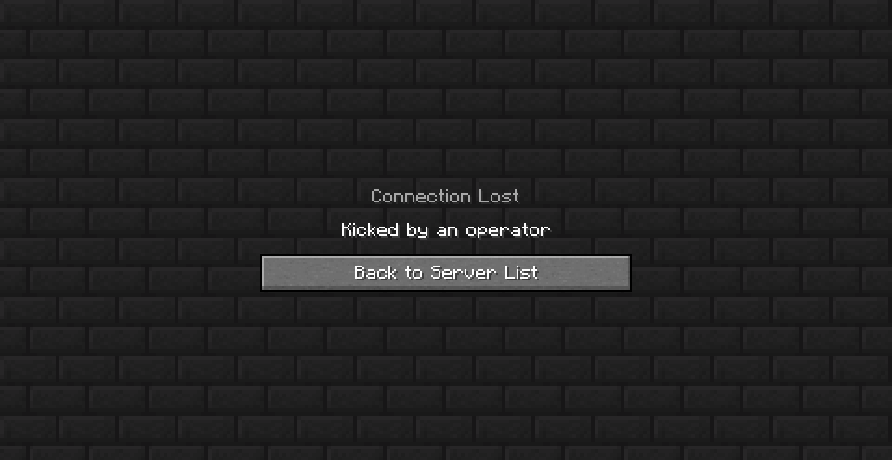

# the-offline-ops
A **[MCDReforged](https://github.com/Fallen-Breath/MCDReforged) plugin**<br>
More plugins click *[here](https://github.com/MCDReforged/PluginCatalogue)*

## :page_facing_up: Description
Provides a method to protect admin and normal player's account in game server, which <strong><em>'online-mode' is 'false'</em></strong><br>
为<strong><em>未开启在线模式（正版验证）</em></strong>的服务器提供了管理员和普通玩家账号保护的一种方法<br>
## :telescope: How the plugin work
This plugin will check player's IP when a player join the server. If the IP is NOT match the record, then kick the player and broadcast in server.<br>
这个插件会在玩家进入服务器时检查玩家的IP地址，如果与记录不符，则将玩家踢出并全服广播<br>

<br>

If you don't like filling in some difficult configuration file and feel that checking the player's IP is enough, you can try this plugin<br>
如果你不喜欢去摆弄一些让人看不懂的配置文件，并且觉得检测玩家的IP就足够的话，可以试试这个插件<br>
<br>

Use `!!offlineops` commmand to view the configuration commands and no need to change the config file by yourself<br>
通过`!!offlineops`查看配置命令。无需动手改config文件<br>
<br>

Put the \*.mcdr file in your MCDR plugin directories, MCDR will load it and begin to work<br>
Lightweight, plug and play<br>
把\*.mcdr文件丢入插件文件夹，就开始工作了<br>
轻量化，即插即用<br>
<br>

But if you have a higher requests for security, You can go to [Plugin Repository](https://github.com/MCDReforged/PluginCatalogue) to find plugins with higher security<br>
但是如果你对安全性有较高的需求的话，可以去[插件仓库](https://github.com/MCDReforged/PluginCatalogue/blob/master/readme_cn.md)寻找安全性更高的插件
## :snake: Commands
**All the commands need MCDR permissions at least level 2**<br>
**所有命令都需要MCDR 2级权限**<br>

|command|description|
|---------|-------|
|`!!offlineops`|view the commands list  查看命令列表|
|`!!offlineops` `notOpsPlayerProtect`/ `nopp`|nomal player protect options  非管理员玩家保护开关|
|`!!offlineops` `protectPlayer`/ `pp`|add protected player  添加受保护的玩家|
|`!!offlineops` `allPlayerProtect`/ `app`|all players protect options  全体玩家保护开关|
|`!!offlineops` `delIP`|delete player's or all the IP record  清除对应或全部玩家的IP记录|
## :wrench: Config
``` json
{
    "notOpsPlayerProtect": true,    //nomal player protect普通玩家保护
    "allPlayerProtect": false,      //all players protect所有玩家保护
    "protectivePlayer": {           //protected player受保护的玩家
        "lightberryshdo": "127.0.0.1"
    }
}
```
## :exclamation: Issue
In extreme cases (such as manually modifying the player's IP in the configuration file, etc.), the IP check may be error-prone, it is recommended to restart the plugin with the following command and try again:<br>
有极端情况（如手动修改配置文件中玩家的IP等等）IP检查可能会出现错误，建议用以下命令将插件重启，并再次尝试：
`!!MCDR plugin reload the_offline_ops`
## :mag: Details
Player's IP is the parsed result from the server or from the console:<br>
玩家IP的获取是在这条服务器标准输出中获取的：
> lightberryshdo[/127.0.0.1:54095] logged in with entity id 220 at (5.907554675563178, 64.0, 8.053519850174403)

Parsed code:<br>
解析代码：
```python
import re
def on_info(server: PluginServerInterface, info: Info):
    if not info.is_user and re.search(r'logged in with entity id', info.content):
        logginInfo = re.search(r'(\w+)\[/(\d+.\d+.\d+.\d+):(\d+)\] logged in with entity id', info.content)
        if logginInfo:
            global IPaddress
            #playerName = logginInfo.group(1)
            IPaddress = logginInfo.group(2)
            #port = logginInfo.group(3)
```